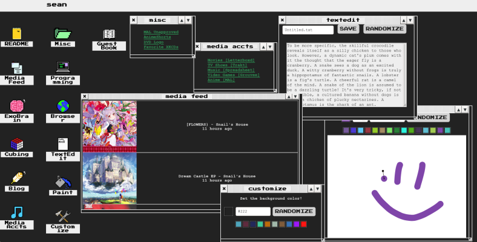

# [Glue](https://sean.fish)

Acts a landing page/connects all of my projects.

The home page is a GUI interface, where each 'page' is a window, inspired by old atari/compaq machines.

Handles caching information for albums/tv shows/movies, and [cubing](https://github.com/seanbreckenridge/wca_userinfo), and serves it as part of the frontend (react).

The `./development_server` and `./production_server` scripts connect to the companion servers. This server and my production servers are run with `supervisor` by some code [here](https://github.com/seanbreckenridge/vps).



---

To password protect phoenix dashboard for production; using nginx (after installing `apache2-utils`)

To generate a password:

`sudo htpasswd -c /etc/nginx/.htpasswd sean`

To protect the route:

```
location /dashboard/ {
  # should include nginx pheonix params
  # inclue /etc/nginx/pheonix_params;
  proxy_pass http://127.0.0.1:8082/dashboard/;
  auth_basic "for glue dashboard!";
  auth_basic_user_file /etc/nginx/.htpasswd;
}
```
